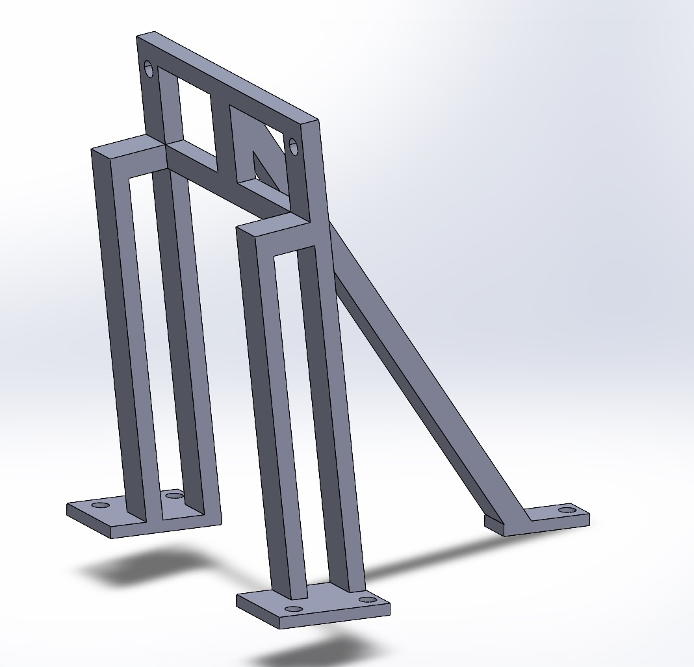

# RockeyDodger - ROS2 Collision Detection 

## MAE 148 Final Project | Summer Session 2 - Team 3

Inspired by planetary rovers, we propose an autonomous car that detects objects such as rocks, plants, and humans, approaches them, and stops at a safe distance to steer away and continue its path. The system integrates:

- **LiDAR** to sense objects along the path and measure safe stopping distance.  
- **OAK-D Lite** to classify objects (plant, rock, or human) using camera feed.  
- **ROS2** to coordinate messages from LiDAR and OAK-D Lite and generate navigation commands.  

---

## Table of Contents
1. [Members](#members)  
2. [Device](#device)  
3. [Wiring Diagram of Device](#wiring-diagram-of-device)  
4. [Hardware](#hardware)  
5. [Project Idea - Foresight](#project-idea---foresight)  
6. [Instructions for Our Project - What We Have Done](#instructions-for-our-project---what-we-have-done)  
7. [SLAM](#slam)  
8. [DepthAI-ROS Installation](#depthai-ros-installation)  
9. [Combination between DepthAI ROS and Node Packages on ROS2](#combination-between-depthai-ros-and-node-packages-on-ros2)  
10. [Path Planner](#path-planner)  
11. [Future Development](#future-development)  
12. [Resources](#resources)  
13. [Acknowledgments](#acknowledgments)  
14. [Contact](#contact)  

---

## Members
- Junrong Zhou  
- John V.  
- Erik T.  
- Veeral Patel - vmpatel@ucsd.edu  

---

## Device
The autonomous rover is based on a four-wheel differential drive platform, equipped with a LiDAR, an OAK-D Lite camera, and onboard Jetson Nano for computation. We also have GPS

**RoboCar Base**

**Camera Mount Trials**

**Jetson Nano Housing**

---

## Wiring Diagram of Device

---

## Hardware Architecture  

- **Jetson Nano** – Onboard edge computing platform responsible for running ROS2 nodes, sensor fusion, and real-time decision making.  
- **OAK-D Lite** – RGB-D camera used for object classification (plant, rock, human) and depth estimation.  
- **LiDAR Sensor (LD06)** – Provides 360° range measurements for obstacle detection and SLAM.  
- **Motors & VESC Motor Driver** – Differential drive control with precise velocity and steering input handling.  
- **Custom Mounting Rig** – Includes 20° angled camera mount, GPS/LiDAR stand, and Jetson Nano housing for stable field deployment.  

---

## Software Stack  

### Core Framework  
- **ROS2 (Foxy)** – Middleware for distributed robotics communication.  
- **DepthAI-ROS** – Bridge for OAK-D Lite depth and object recognition output.  
- **VESC ROS Drivers** – Interface for motor actuation.  
- **SLAM Toolbox** – Used for mapping and localization.  

### Implemented Nodes  
- **lane_detection_node** – Extracts lane line centroids (for structured environments).  
- **lane_guidance_node** – PID control based on tracking error for steering and throttle.  
- **safety_stop_node** – Subscribes to LiDAR scans and halts the rover within a critical distance.  
- **safety_ping_node** – Triggers OAK-D object detection when an obstruction is detected.  
- **vesc_twist_node** – Converts navigation commands into motor driver signals.  

---

## Key Features  

### Obstacle Detection & Avoidance  
- LiDAR-based obstacle detection with configurable safe stopping distance.  
- DepthAI classification to distinguish between object types (e.g., rock vs. human).  
- Reactive planner that decides whether to stop, wait, or re-route based on object type.  

### SLAM & Mapping  
- Fuses LiDAR data with wheel odometry for 2D mapping.  
- Enables loop-based navigation and environment-aware path selection.  
- ROS2 mapping/localization packages used for real-time decision support.  

### Integrated Perception  
- Sensor fusion between LiDAR and OAK-D Lite ensures redundancy.  
- LiDAR handles precise distance measurements, while the OAK-D Lite handles semantic understanding.  
- Combined signals feed into navigation nodes for reactive path planning.  

---

## System Demonstrations  
- **Challenge 1**: Detection and avoidance of a person and a small obstacle (e.g., bottle).  
- **Challenge 2**: Multi-object environment with mixed stationary and dynamic obstacles.  
- Experiments conducted in lab and outdoor testbeds with logged datasets for post-processing and evaluation.  

---

## Path Planning  
- **Reactive Planner**: Uses LiDAR distance data and classification labels to choose turning direction.  
- **Safety Protocols**:  
  - Human detected → vehicle halts until path is clear.  
  - Static obstacle detected → rover computes detour and resumes forward motion.  
- **Future upgrade**: Incorporating hybrid A* or RRT-based global planners for structured environments.  

---

## Future Work  
- Extend SLAM with loop closure and map optimization.  
- Develop custom-trained neural networks for broader obstacle classes.  
- Enhance planner with dynamic velocity control and adaptive safety margins.  
- Integrate telemetry dashboard for remote monitoring and debugging.  
- Explore multi-camera setups for lane following and object detection simultaneously.  

---

## Resources  
- [ROS2 Documentation](https://docs.ros.org/en/foxy/index.html)  
- [DepthAI SDK](https://docs.luxonis.com/)  
- [Jetson Nano Setup Guide](https://developer.nvidia.com/embedded/learn/get-started-jetson-nano-devkit)  
- Selected planetary rover research papers for design inspiration  

---

## Acknowledgments  
Special thanks to **UC San Diego Jacobs School of Engineering**, **Professor Jack Silberman**, **Alexander Haken**, and our classmates for feedback and collaboration.  

## Team  
- Junrong Zhou  
- John V.  
- Erik T.  
- Veeral Patel – vmpatel@ucsd.edu  
